# VirtualBox-Linux
Start VirtualBox for Linux
1. Проверить Виртуализацию на Desktop:
   
    а. Открыть Диспетчер задач: CTRL + SHIFT + ESC или CTRL + ALT + DELETE.
    
    b. Перейти Производительность: 
    
    c. Если виртуализация выключена, то нужно зайти в BIOS:
        
        - Перезапустить компютер, вход BIOS: DEL, F2, F8, F9, F10
BIOS MSI:

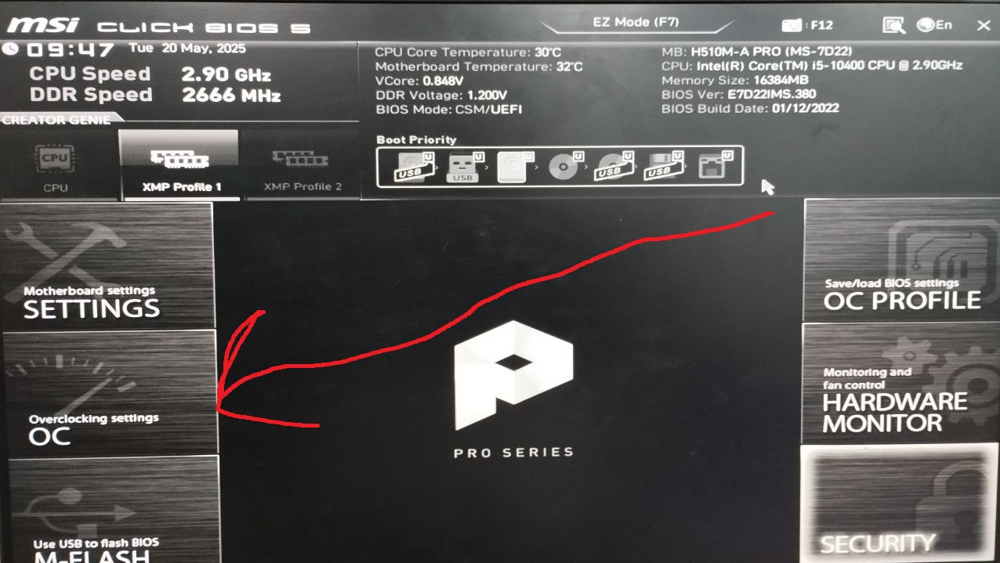
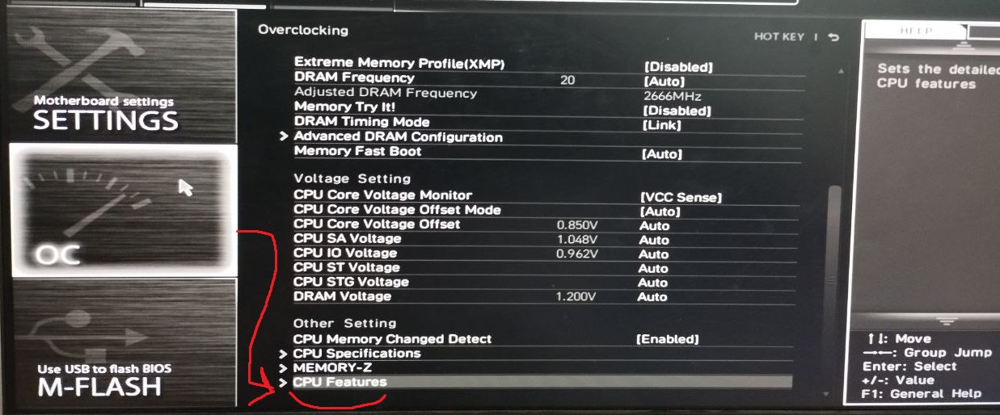
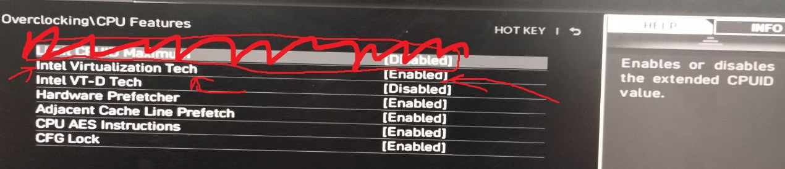

BIOS ASUS:

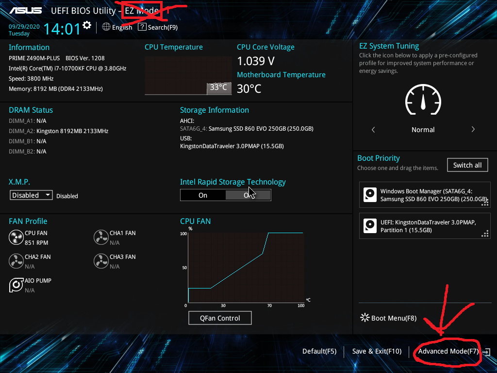
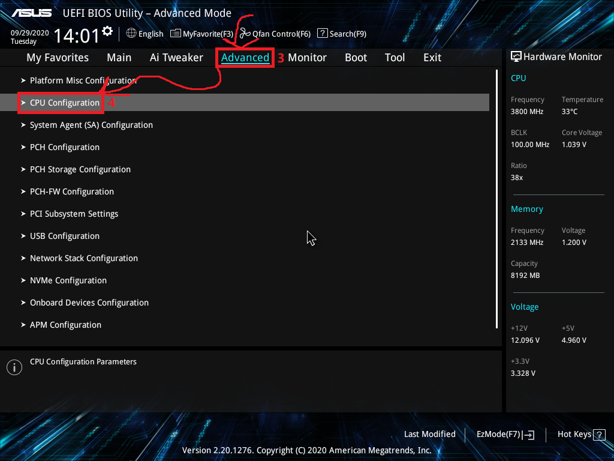
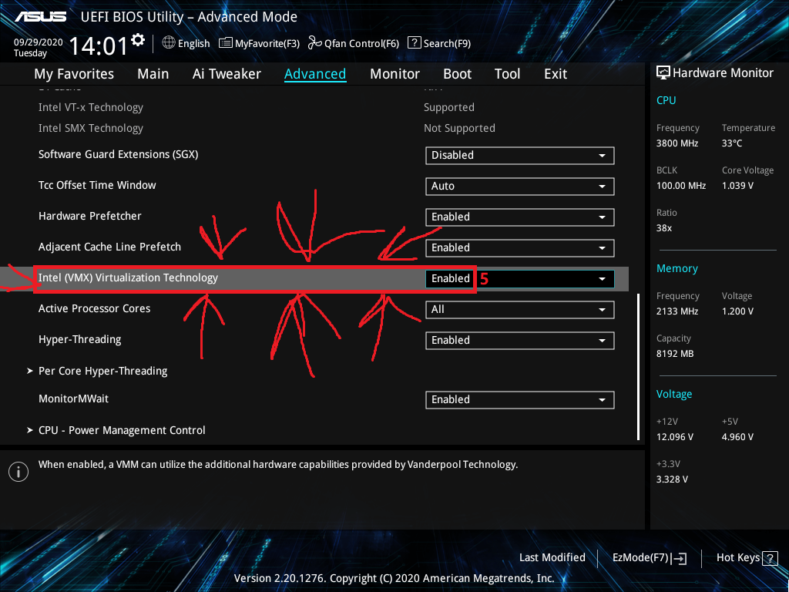
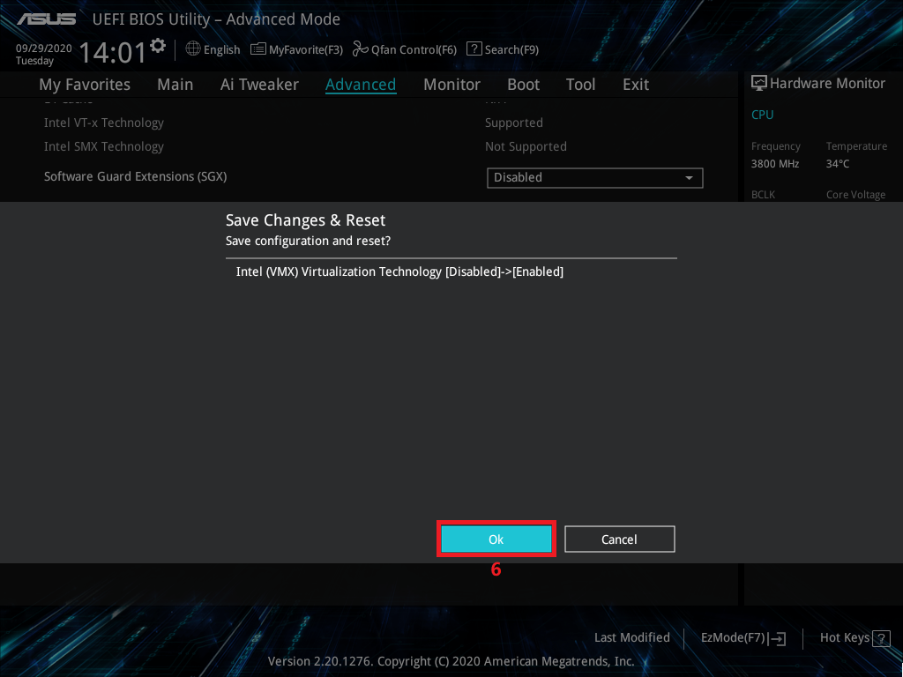

BIOS HP:

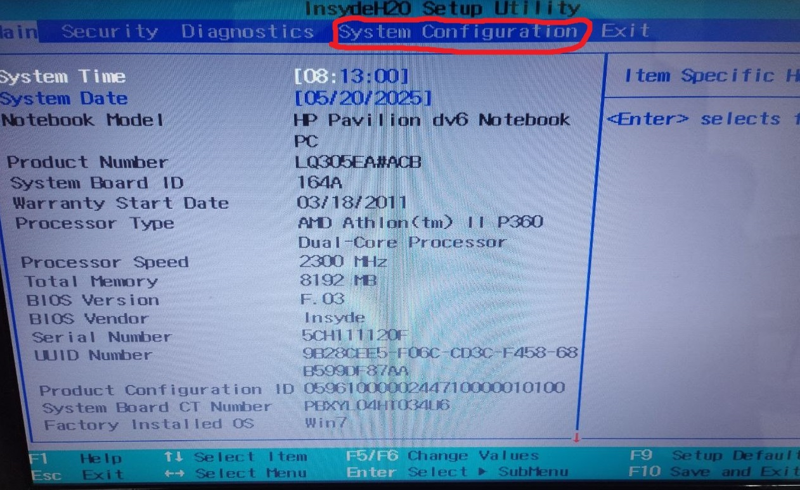
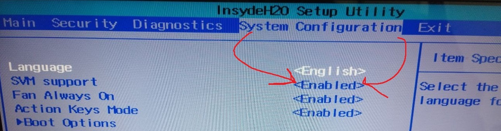

НЕ ЗАБЫВАТЬ СОХРАНИТЬ ПЕРЕД ТЕМ ВЫХОДИТЬ

2. Скачать и установить
<a href="https://www.virtualbox.org/wiki/Downloads" target="_blank">VirtualBox</a>
    
    a. Если выдасть это

    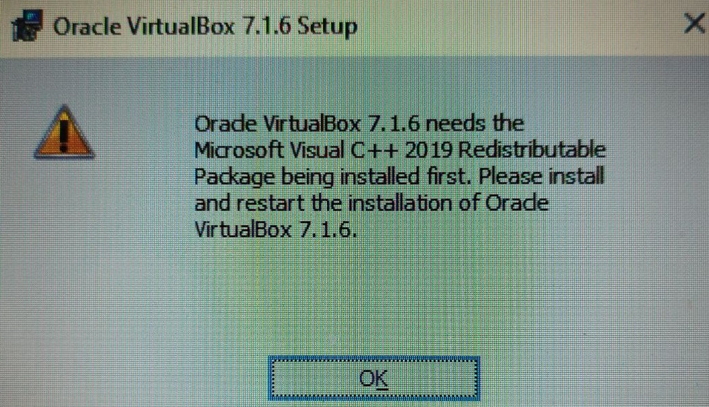

то вам надо установить
    <a href="https://learn.microsoft.com/en-us/cpp/windows/latest-supported-vc-redist?view=msvc-170#visual-studio-2015-2017-2019-and-2022" target="_blank"> Microsoft Visual C++ Redistributable 2019</a>

b. Путь установки ПРОГРАММЫ диск C:/

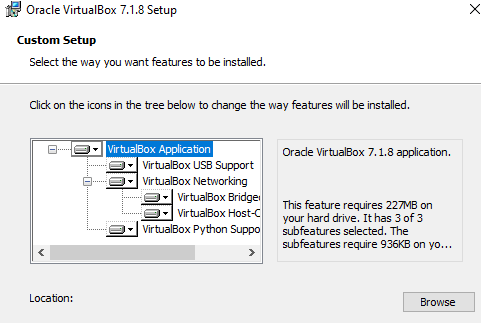
