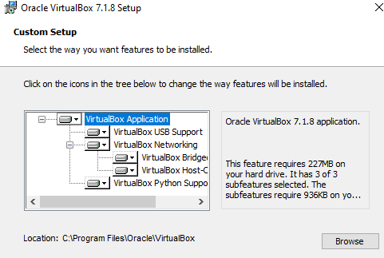

# VirtualBox-Linux
Start VirtualBox for 
<a href="https://ru.wikipedia.org/wiki/Linux" target="blank">Linux</a>
.
1. Проверить Виртуализацию на Desktop:
   
    а. Открыть Диспетчер задач: CTRL + SHIFT + ESC или CTRL + ALT + DELETE потом выбираем --> "Диспетчер задач".
    
    b. Перейти Производительность: 
    
    c. Если виртуализация выключена, то нужно зайти в 
    <a href="https://ru.wikipedia.org/wiki/BIOS" target="blank">BIOS</a>
    :
        
        - Перезапустить компютер, вход BIOS: DEL, F2, F8, F9, F10
BIOS MSI:

BIOS ASUS:

BIOS HP:

НЕ ЗАБЫВАТЬ СОХРАНИТЬ ПЕРЕД ТЕМ ВЫХОДИТЬ!!!

      -F10
2. Скачать и установить
<a href="https://www.virtualbox.org/wiki/Downloads" target="_blank">VirtualBox</a>
    
    a. Если выдасть это

    

то вам надо установить
    <a href="https://learn.microsoft.com/en-us/cpp/windows/latest-supported-vc-redist?view=msvc-170#visual-studio-2015-2017-2019-and-2022" target="_blank"> Microsoft Visual C++ Redistributable 2019</a>.

b. Путь установки ПРОГРАММЫ диск C:\

1. Если у вас старая железа, не работает и нету win32api:

Установить 
<a href="https://www.python.org/downloads/" target="_blank">python</a>

После установки Python, в Командной строке(Админ) или Windows PowerShell x86/x64(Админ) 

        - py -m pip install pywin32 

Вторая команда:

    - python.exe -m pip install --upgrade pip
если это не работает

    - py -m pip install --upgrade pip

c. Виртуальную машину из .vdi .vhd .vmdk .hdd .qcow .qemu В ПАПКУ ДИСК D:\

3. Установка для Linux Дистрибутив.

a. Для начинающих: <a href="https://ubuntu.com/download/desktop" target="_blank">Ubuntu Desktop</a> или <a href="https://ubuntu.com/download/server" target="_blank">Ubuntu Server</a>;

!!! Лучший вариант это Ubuntu c LTS !!!

LTS (Long Term Support): Получает поддержку в течение 5 лет.

<a href="https://linuxmint.com/download_all.php" target="_blank">Linux Mint</a>

b. Вы можете заранее написать Имя пользователя и пароль.

ПО УМОЛЧАНИЮ СТОИТ ПАРОЛЬ !!!

      -changeme

Настройка оперативной памяти и ядра.

c. Требования к оборудованию для установки Linux:

  1. <a href="https://ru.wikipedia.org/wiki/Ubuntu" target="_blank">Ubuntu</a> (На базе Debian):

     CPU (процессор): не менее 2 ядра и 2 ГГц.

     RAM (оперативная память): от 4 ГБ.

     Диск: от 25 ГБ.

Доступ к сети: рекомендуется использовать кабельное подключение.

 2. <a href="https://ru.wikipedia.org/wiki/Linux_Mint" target="_blank">Linux Mint</a> (На базе Debian и Ubuntu): 

     2 ГБ ОЗУ (рекомендуется 4 ГБ для комфортного использования).

     20 ГБ дискового пространства.

d. Подключение образ Дополнительный ОС

1. ВАМ НУЖНО ВЫБРАТЬ РАСКЛАДКУ USA (Только для Ubuntu!):  

а потом после установки, заходим в настройки -> Клавиатура

 

Менять языки при помощи клавиши Win + Spacebar(Пробел).

2. 
    Если у вас не получится подключить или не работает "образ дополнений гостевой ос", то вам надо: 

   Установить на Виртуальную машину bzip2 !!!

     1. Открываем терминал Ctrl + Alt + T

     2. В терминале пишим эту строку

       - $ sudo apt update && sudo apt install bzip2 -y

      <a href="https://ru.wikipedia.org/wiki/Sudo" target="blank">sudo</a>
      ( Substitute User and do ) - запуск команды с правами администратора (root);

      <a href="https://ru.wikipedia.org/wiki/Advanced_Packaging_Tool" target="blank">apt</a>
      ( Advanced Packaging Tool ) - пакетный менежер на основе 
    <a href="https://ru.wikipedia.org/wiki/Debian" target="blank">Debian</a>;

    update - Обновление баз данных пакетов;

    && - Логический оператор "И". Если первая команда выполнится успешно, то выполнится вторая;

    install bzip2 - Установить пакет bzip2;

    -y -автоматически отвечает "yes" на запрос подтверждения (пропускает вопрос "Do you want to continue? [Y/n]").

2.1 Потом в Oracle VituralBox заходим в "Устройства" --> "подключить образ дополнений гостевой ос"

Выбираем образ диска (это VBox_GAs_"версия программы Oracle VituralBox") и нажимаем "Запустить Центр приложений"

