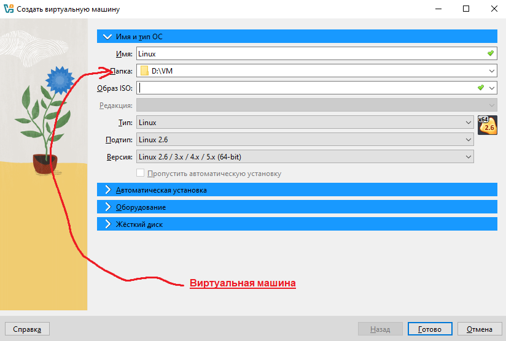

# VirtualBox-Linux
Start VirtualBox for Linux.
1. Проверить Виртуализацию на Desktop:
   
    а. Открыть Диспетчер задач: CTRL + SHIFT + ESC или CTRL + ALT + DELETE.
    
    b. Перейти Производительность: 
    
    c. Если виртуализация выключена, то нужно зайти в BIOS:
        
        - Перезапустить компютер, вход BIOS: DEL, F2, F8, F9, F10
BIOS MSI:

BIOS ASUS:

BIOS HP:

НЕ ЗАБЫВАТЬ СОХРАНИТЬ ПЕРЕД ТЕМ ВЫХОДИТЬ!!!

      -F10
2. Скачать и установить
<a href="https://www.virtualbox.org/wiki/Downloads" target="_blank">VirtualBox</a>
    
    a. Если выдасть это

    

то вам надо установить
    <a href="https://learn.microsoft.com/en-us/cpp/windows/latest-supported-vc-redist?view=msvc-170#visual-studio-2015-2017-2019-and-2022" target="_blank"> Microsoft Visual C++ Redistributable 2019</a>.

b. Путь установки ПРОГРАММЫ диск C:\

c. Виртуальную машину из .vdi .vhd .vmdk .hdd .qcow .qemu В ПАПКУ ДИСК D:\

3. Установка для Linux Дистрибутив.

a. Для начинающих: <a href="https://ubuntu.com/download/desktop" target="_blank">Ubuntu Desktop</a> или <a href="https://ubuntu.com/download/server" target="_blank">Ubuntu Server</a>;

<a href="https://linuxmint.com/download_all.php" target="_blank">Linux Mint</a>

b. Вы можете заранее написать Имя пользователя и пароль.

ПО УМОЛЧАНИЮ СТОИТ ПАРОЛЬ !!!

      -changeme

c. Требования к оборудованию для установки Linux:

  1. Ubuntu (На базе Debian):

     CPU (процессор): не менее 2 ядра и 2 ГГц.

     RAM (оперативная память): от 4 ГБ.

     Диск: от 25 ГБ.

Доступ к сети: рекомендуется использовать кабельное подключение.

 2. Linux Mint (На базе Debian и Ubuntu): 

     2 ГБ ОЗУ (рекомендуется 4 ГБ для комфортного использования).

     20 ГБ дискового пространства.

d. Подключение образ Дополнительный ОС

1. 
    Если у вас не получится подключить в Ubuntu, то вам надо: 

   Установить на Виртуальную машину ZIP2 !!!

       - $ sudo apt update

       - $ sudo apt install bzip2